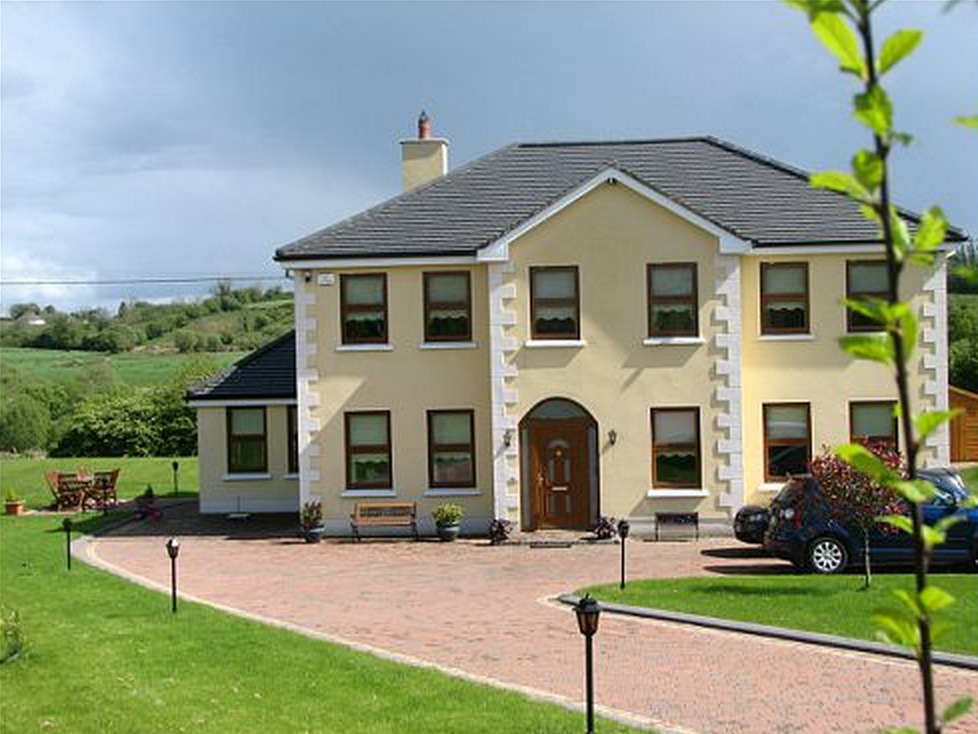

simplegmaps v0.6.0
===========

simplegmaps - Add google maps to your web without knowing squat about JavaScript

##Background
I found that other scripts was too complicated to deal with and needed much scripting just to set a marker on a map. I want to separate HTML markup from JavaScript as much as possible and I want the user of the script to be able to add markers to a map without writing a single line JavaScript.

Meet simplegmaps!

##Features
* Display one or multiple markers on your map
* Add info windows to markers with custom html markup
* Display routes on your map
* No scripting necessary
* Support for traffic layers (new!)
* Support for weather layers (new!)
* Support for automatic geo location (new!)
* Support for bicycle route layer (new!)
* Support for custom marker icons (new!)
* Support for geo location on demand, by clicking a button for example (new!)
* Custom InfowWindow - Position and style your own custom infowindow.

##Browser Support
* Google Chrome
* Internet Explorer 8+
* Firefox
* Safari 6+

###[View demo](http://www.andreasnorman.com/simplegmaps)

##Installation
```
bower install simplegmaps --save
```

##Setup
```html
<!-- You'll need jquery -->
<script src="dependencies/jquery/dist/jquery.min.js"></script>
<!-- You'll also need access to google maps api -->
<script src="https://maps.googleapis.com/maps/api/js?sensor=false" type="text/javascript"></script>
<!-- and you'll need to include simplegmaps of course! -->
<script src="../src/jquery.simplegmaps.js"></script>
```

##Usage
```javascript
$('#id_of_your_div').simplegmaps();
```

###Settings and Defaults
```javascript
defaults = {
	GeoLocation: false,
  MapOptions: {
    draggable: true,
    zoom: 8,
    scrollwheel: false,
    streetViewControl: false,
    panControl: true,
    zoomControl: true,
    zoomControlOptions: {
      style: 'DEFAULT'
    }
  },
	getRouteButton: '#simplegmaps-getroute',
	getTravelMode: '#simplegmaps-travelmode',
	routeDirections: '#simplegmaps-directions',
	externalLink: '#simplegmaps-external',
	getFromAddress: '#simplegmaps-fromaddress',
	defaultTravelMode: 'DRIVING'
};

```
* `GeoLocation`: Active or deactive automatic geolocation. Default false (inactive)
* `MapOptions`: [Google Maps MapOptions](https://developers.google.com/maps/documentation/javascript/reference?csw=1#MapOptions)
* `getRouteButton`: ID of the button used to submit the route to the map
* `getTravelMode`: ID of the select element to hold the travelmode data
* `getFromAddress`: ID of the input element to hold the address to set the route start point
* `externalLink`: ID of the link element to be used when targeting a button to open up the map in a new tab. On mobile devices either Apple Maps or Google Maps app is opened instead.
* `defaultTravelMode`: The default travel mode is nothing else specified. Choose between DRIVING, WALKING or BICYCLING


###Adding markers to a map
You can use an address or latitude and longitude to position a marker on a map using the `data` attribute.
```html
<div id="simplegmap">
	<div class="map-marker" data-title="Lorem ipsum" data-latlng="55.5897407,13.012268899999981"></div>
	<div class="map-marker" data-title="Remi" data-address="Remi 145 W 53rd St, New York, NY, United States"></div>
</div>
```

###Adding a info window to a maker
You can add any html markup you wish to an info window but you need to add the class `map-infowindow` to the outer element.
```html
<div class="map-marker" data-title="Remi" data-address="Remi 145 W 53rd St, New York, NY, United States">
	<div class="map-infowindow">
	  <h2>Remi</h2>
	  <p>Remi 145 W 53rd St, New York, NY, United States</p>
	</div>
</div>
```

###Adding a map with route funtionality
```html
<div id="simplegmap">
	<div class="map-marker" data-title="Applejack Diner" data-address="Applejack Diner 1725 Broadway New York, NY 10019"></div>
</div>

<div>
	<div>
  	<label>From address</label>
   	<input type="text" id="simplegmaps-fromaddress">
  </div>
  <div>
     <label>Travel Mode</label>
     <select class="form-control" id="simplegmaps-travelmode">
      <option value="DRIVING">Driving</option>
      <option value="WALKING">Walking</option>
      <option value="BICYCLING">Bicycling</option>
    </select>
  </div>
  <div>
    <button type="submit" id="simplegmaps-getroute">Get route</button>
  </div>
</div>
```

If you change any default element ID's you'll need to set some options when you initiate the map
```javascript
$('#simplegmap').simplegmaps({
  getRouteButton: '#simplegmaps-getroute',
  getTravelMode: '#simplegmaps-travelmode',
  getFromAddress: '#simplegmaps-fromaddress'
});
```

###Adding a map with automatic geolocation
```html
<div id="simplegmap" class="google-map"></div>
```

```javascript
$('#simplegmap').simplegmaps({
  GeoLocation: true
});
```

###Adding a map with geolocation by user click
```html
<div id="simplegmap" class="google-map"></div>
<a href="#" id="geoLocationButton">Geolocate me dawg!</a>
```

```javascript
$('#simplegmap').simplegmaps();
$('#geoLocationButton').on('click', function(event) {
  event.preventDefault();
  $('#simplegmap-1').simplegmaps('setGeoLocation');
});
```

###Adding a map with different layers
Currently this plugin supports weather, traffic and bicycle layers.

In order to make weather layer work you need to include the Google Maps weather library by appending `&libraries=weather` to the path
```html
    <script src="https://maps.googleapis.com/maps/api/js?v=3.exp&sensor=false&libraries=weather"></script>
```

```html
<div id="simplegmap" class="google-map">
  <div class="map-marker" data-title="Remi" data-address="Remi 145 W 53rd St, New York, NY, United States"></div>
</div>
<a href="#" id="toggleTraffic" class="btn btn-primary">Toggle Traffic Layer</a>
<a href="#" id="toggleWeather" class="btn btn-primary">Toggle Weather Layer</a>
<a href="#" id="toggleBicycle" class="btn btn-primary">Toggle Bicycle Layer</a>

```

```javascript
$('#simplegmap').simplegmaps();

$('#toggleTraffic').on('click', function(e) {
  e.preventDefault();
  $('#simplegmap').simplegmaps('toggleTrafficLayer');
});
$('#toggleWeather').on('click', function(e) {
  e.preventDefault();
  $('#simplegmap').simplegmaps('toggleWeatherLayer');
});
$('#toggleBicycle').on('click', function(e) {
  e.preventDefault();
  $('#simplegmap').simplegmaps('toggleBicycleLayer');
});
```

###Example using snazzy maps to spice up the map style a bit
[Snazzy Maps](http://snazzymaps.com) is a nice resource to find color and style themes for Google Maps. Snazzy Maps themes are 100% compatible with simplegmaps (as it simply works out of the box with Google Maps API).

```html
<div id="simplegmap" class="google-map">
  <div class="map-marker" data-title="Remi" data-address="Remi 145 W 53rd St, New York, NY, United States"></div>
</div>
```

```javascript
$('#simplegmap').simplegmaps({
  MapOptions: {
    styles: [{"featureType":"water","stylers":[{"visibility":"on"},{"color":"#acbcc9"}]},{"featureType":"landscape","stylers":[{"color":"#f2e5d4"}]},{"featureType":"road.highway","elementType":"geometry","stylers":[{"color":"#c5c6c6"}]},{"featureType":"road.arterial","elementType":"geometry","stylers":[{"color":"#e4d7c6"}]},{"featureType":"road.local","elementType":"geometry","stylers":[{"color":"#fbfaf7"}]},{"featureType":"poi.park","elementType":"geometry","stylers":[{"color":"#c5dac6"}]},{"featureType":"administrative","stylers":[{"visibility":"on"},{"lightness":33}]},{"featureType":"road"},{"featureType":"poi.park","elementType":"labels","stylers":[{"visibility":"on"},{"lightness":20}]},{},{"featureType":"road","stylers":[{"lightness":20}]}]
  }
});
```

###Adding custom marker icons
Use the data attribute `data-icon` to specify the path to an image you wish to use as icon.
```html
<div id="simplegmap" class="google-map">
  <div class="map-marker" data-title="Remi" data-icon="img/mmazure.png" data-address="Remi 145 W 53rd St, New York, NY, United States"></div>
</div>
```

###Creating custom info windows
If you want to totally customize the position, layout and design of the info window you'll need to first wrap your map with div that has the following CSS
```css
overflow: hidden;
position: relative;
```

You can then create your info window as usual, but instead use the class name `map-custom-infowindow`

```html
<div class="simplegmap-content">
  <div id="simplegmap" class="google-map">
    <div class="map-marker" data-title="Remi" data-address="Remi 145 W 53rd St, New York, NY, United States">
      <div class="map-custom-infowindow">
        <button type="button" class="close" aria-hidden="true">&times;</button>
        
        <h2>Remi</h2>
        <p>Remi 145 W 53rd St, New York, NY, United States</p>
      </div>
    </div>
  </div>
</div>
```

And to make it shine, add some style to your custom info window
```css
.map-custom-infowindow {
  position: absolute;
  display: block;
  bottom: 30px;
  left: 0;
  margin-left: 15%;
  margin-right: 15%;
  width: 70%;
  min-height: 120px;
  border: 1px solid #bcb8ac;
  background-color: #fff;
  color: #333;
  z-index: 10;
  padding: 10px;
  border-radius: 10px;
}
```

##changelog
####0.6.0
* Removed weather layer because of [Google Maps deprication](https://developers.google.com/maps/documentation/javascript/examples/layer-weather)

####0.5.0
* Added custom info windows

####0.4.0
* Added support for custom marker icons.
* Added toggle function for bicycle layer

####0.3.2
* FIX: Error occured when no markers was placed.
* FIX: MapOptions.Center did work as expected.
* FIX: Noticed that the zoom property of MapOptions was mandatory. Added fallback to default zoom setting.

####0.3.1
* FIX: Will no longer autofit when no markers has been added.

####0.3.0
* Added support for traffic layer
* Added support for weather layer
* Added support for automatic geo location
* Added support for geo location on demand (by clicking a button for example)
* Added example with snazzy maps

####0.2.0
First public release.
